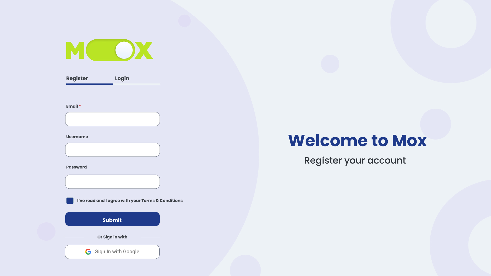
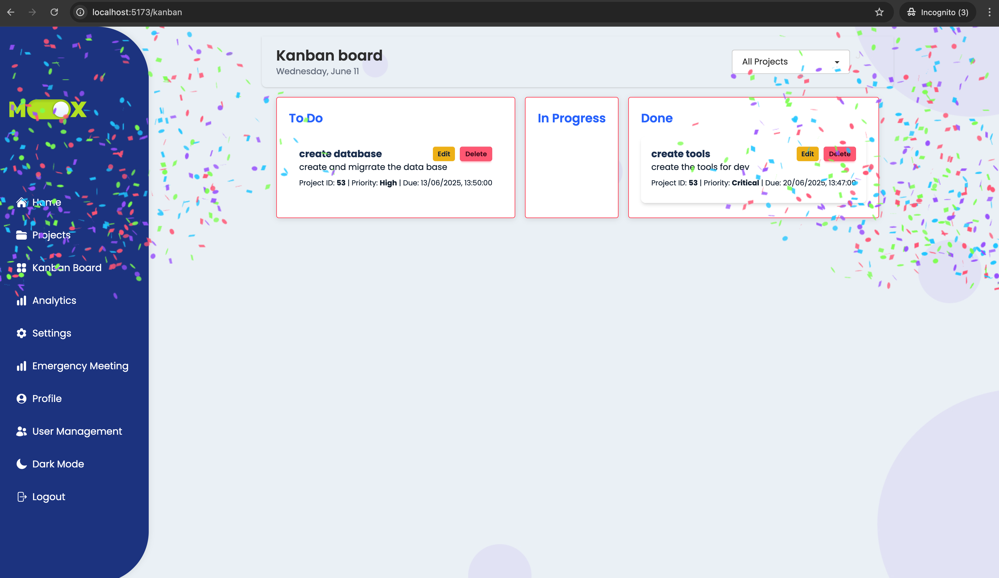

<!-- Banner -->

  

<h2 align="center">Modern Project & Task Management App (Electron + React + TypeScript)</h2>

<!-- Badges -->

  
  
  
  
  
  
  

---

# MoxBackend

A backend API built with .NET for the Mox project. This API supports task management, project filtering, and integrates with Firebase for file uploads. It also supports CRUD operations, Kanban-style status changes, and more.

> Development status: 🚧 In Progress

## Table of Contents

1. [Description](#description)
2. [Technologies & Tools](#technologies--tools)
3. [Core Features](#core-features)
4. [Installation](#installation)
5. [Run Development Servers](#run-development-servers)
6. [Authors and Acknowledgements](#authors-and-acknowledgements)
7. [Roadmap](#roadmap)
8. [Contributing](#contributing)
9. [Performance & SEO](#performance--seo)
10. [Conclusion](#conclusion)
11. [License](#license)
12. [Tools & Libraries](#tools--libraries)
13. [Resources and Credits](#resources-and-credits)

## Description

MOX is a cross-platform desktop application designed to support small neurodivergent teams with project management. It uses dopamine-driven interactions, visual hierarchy, and drag-and-drop tools to simplify workflows.

**Who it's for**: Teams and individuals who need structure without cognitive overload, including users with ADHD or visual impairments.  
**Why it exists**: Created for the DV300 Interactive Development course at Open Window as a response to the lack of inclusive, structured PM tools.

## Technologies & Tools

  
  
  
  
  
  
  
  

## Core Features

- Drag-and-Drop Kanban
- Sprint Timeline (scrollable, visual tracking)
- Google OAuth2 & JWT Auth
- Role-Based Access (Admin, PM, User, Student)
- Comments on tasks & uploads
- Confetti and visual completion feedback
- Dashboard with progress & analytics
- Firebase for file uploads
- Settings page

## Installation

### Clone repo
<https://github.com/Rynoo1/MoxBackend/tree/main>

### Navigate to project

cd MoxBackend & cd MoxFrontend

### Install dependencies

npm install         # For Frontend
dotnet restore      # For Backend

## Run development servers

dotnet run          # Backend
npm run dev         # Frontend

# Authors and Acknowledgements

- Ryno de Beer - Role System, Auth, Timeline, Google Login
- Tebogo Ramolobeng – Task Management, UX/UI, Animation
- Michaela Kemp – Emergency Meeting, Comments, Testing
- Phillip van der Hoven – Project & Sub Tasks, File Handling

## Roadmap

- Google Calendar sync (future)
- Explore mobile-friendly views for Kanban board

### Contributing

This is a closed academic project. If you’d like to reuse any part of MOX or collaborate on improvements, please contact the authors listed above. Contributions are welcome for non-commercial academic use.

## Conclusion

MOX is more than a task manager—it's an inclusive, UX-driven solution tailored for real teams with real struggles. From dopamine-triggered visuals to role-based workflows and file handling, every feature was crafted with purpose. The app stands as both a fully functional PM tool and a proof of concept for designing with empathy. Whether adopted by neurodivergent users or general teams, MOX exemplifies how design, accessibility, and performance can work together to reduce friction and increase productivity.

## License

**Educational Use Disclaimer**  
This project was created as part of coursework for Interactive Development (DV300) at Open Window and is intended for personal portfolio use only.  
Not licensed for redistribution or commercial use.

© Byte Me Team, 2025. All rights reserved.

## Tools & Libraries

- [Heroicons](https://heroicons.com/) – Beautiful hand-crafted SVG icons by the makers of Tailwind CSS  
- [DaisyUI](https://daisyui.com/) – Tailwind CSS component library for rapid UI development  
- [Tailwind CSS](https://tailwindcss.com/) – Utility-first CSS framework  
- [Firebase](https://firebase.google.com/) – File storage and authentication  
- [DnD Kit](https://dndkit.com/) – Drag and drop for modern web apps  

## Resources and Credits

The following resources were referenced or adapted during development:

- Firebase file upload logic adapted from  
  [Fireship Firebase Storage tutorial](https://www.youtube.com/watch?v=1aXZQcG2Y6I)

- Drag-and-drop system built using [@dnd-kit/core](https://github.com/clauderic/dnd-kit)

- Role-based access setup inspired by  
  [Dev.to post: Role-based Auth in ASP.NET Core](https://dev.to/xyz/...)

- Confetti animation using  
  [Canvas Confetti](https://www.npmjs.com/package/canvas-confetti)

- Readme Icons  
  [Github Icons](https://rahuldkjain.github.io/gh-profile-readme-generator/)

Special thanks to open-source contributors and community threads on  
[Stack Overflow](https://stackoverflow.com/) and  
[GitHub Discussions](https://github.com/)

> All third-party code was used respectfully and modified to suit this academic portfolio project.
